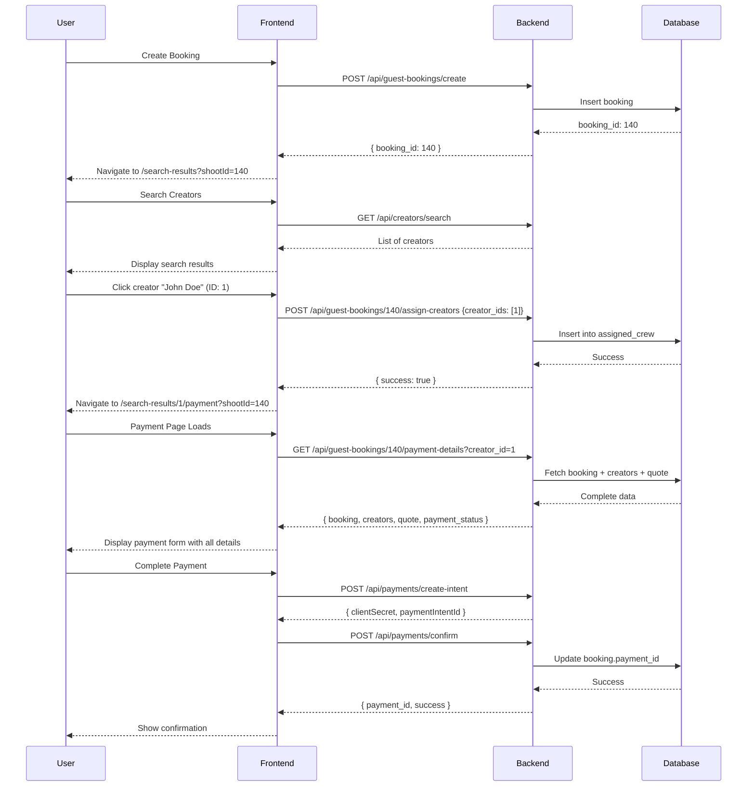

# Booking-Creator Assignment Implementation

**Date**: 2025-12-28
**Status**: ✅ COMPLETE
**Solution**: Option 3 - Long-term database schema with many-to-many relationship

---

## Implementation Summary

Implemented a complete solution for assigning creators to bookings using the existing `assigned_crew` junction table. This enables multiple creators to be assigned to a single booking, supporting the full payment flow from booking creation → creator search → creator selection → payment.

### Key Changes

1. **New API Endpoints** (3 total)
2. **Reused Existing Schema** (`assigned_crew` table)
3. **Updated Model Associations** (Sequelize includes)
4. **Created Utility Script** (for bulk assignments)

---

## Database Schema

### Existing Tables Used

**`stream_project_booking`** (Bookings)
- Primary table for all bookings (guest and authenticated)
- Fields: `stream_project_booking_id`, `project_name`, `guest_email`, `event_date`, `quote_id`, `payment_id`, etc.

**`crew_members`** (Creators/CPs)
- All creative professionals in the system
- Fields: `crew_member_id`, `first_name`, `last_name`, `email`, `hourly_rate`, `rating`, etc.

**`assigned_crew`** (Junction Table) ⭐
- Many-to-many relationship between bookings and creators
- Fields:
  - `id` - Primary key
  - `project_id` - FK to `stream_project_booking`
  - `crew_member_id` - FK to `crew_members`
  - `status` - Assignment status (`selected`, `assigned`, `confirmed`)
  - `crew_accept` - Crew acceptance flag (0/1)
  - `is_active` - Soft delete flag
  - `assigned_date`, `created_at`, `updated_at`

**`quotes`** (Pricing Quotes)
- Linked to bookings via `booking_id` or `quote_id`
- Contains pricing breakdown with line items

---

## API Endpoints

### 1. Assign Creators to Booking

**Endpoint**: `POST /api/guest-bookings/:id/assign-creators`

**Purpose**: Assign one or more creators to an existing booking

**Request**:
```json
POST /api/guest-bookings/140/assign-creators
{
  "creator_ids": [1, 2, 3]
}
```

**Response**:
```json
{
  "success": true,
  "message": "Creators assigned successfully",
  "data": {
    "booking_id": 140,
    "assigned_creators": [
      {
        "assignment_id": 45,
        "creator_id": 1,
        "status": "selected"
      },
      {
        "assignment_id": 46,
        "creator_id": 2,
        "status": "selected"
      }
    ]
  }
}
```

**Behavior**:
- Validates booking exists and is active
- Validates all creator IDs exist
- **Replaces** existing assignments (removes old, creates new)
- Sets status to `selected` (can be updated later to `assigned`, `confirmed`)
- Sets `crew_accept` to 0 (pending crew approval)

**Use Case**: When user selects creators from search results, frontend calls this to link them to the booking.

---

### 2. Get Booking Payment Details

**Endpoint**: `GET /api/guest-bookings/:id/payment-details?creator_id=<optional>`

**Purpose**: Fetch complete payment page data (booking + creators + quote)

**Request**:
```
GET /api/guest-bookings/140/payment-details?creator_id=1
```

**Response**:
```json
{
  "success": true,
  "data": {
    "booking": {
      "booking_id": 140,
      "project_name": "Corporate Video Shoot",
      "guest_email": "client@example.com",
      "event_date": "2025-01-15",
      "event_location": { "address": "Los Angeles, CA", "lat": 34.05, "lng": -118.25 },
      "duration_hours": 4,
      "budget": 2000.00,
      "is_completed": false,
      "payment_completed_at": null
    },
    "creators": [
      {
        "assignment_id": 45,
        "creator_id": 1,
        "status": "selected",
        "crew_accept": false,
        "details": {
          "crew_member_id": 1,
          "name": "John Doe",
          "email": "john@example.com",
          "location": "Los Angeles, CA",
          "hourly_rate": 150.00,
          "rating": 4.8,
          "total_reviews": 42,
          "profile_image": "https://...",
          "bio": "Professional videographer...",
          "years_of_experience": 8
        }
      }
    ],
    "quote": {
      "quote_id": 25,
      "shoot_hours": 4.0,
      "subtotal": 1200.00,
      "discount_amount": 0.00,
      "price_after_discount": 1200.00,
      "margin_amount": 300.00,
      "total": 1500.00,
      "status": "confirmed",
      "line_items": [...]
    },
    "payment_status": "pending"
  }
}
```

**Features**:
- Fetches booking with all assigned creators (includes creator details)
- Optionally assigns a creator via `creator_id` query param (if not already assigned)
- Includes quote data if linked via `quote_id`
- Returns payment status (pending/completed)

**Use Case**: Payment page loads this endpoint to get all data needed for display and payment processing.

---

### 3. Get Guest Booking (Enhanced)

**Endpoint**: `GET /api/guest-bookings/:id`

**Purpose**: Fetch basic booking details (existing endpoint, no changes)

**Response**:
```json
{
  "success": true,
  "data": {
    "booking_id": 140,
    "project_name": "Corporate Video Shoot",
    "guest_email": "client@example.com",
    "event_date": "2025-01-15",
    "duration_hours": 4,
    "budget": 2000.00,
    "event_location": "Los Angeles, CA",
    "is_draft": false,
    "is_completed": false
  }
}
```

**Note**: This endpoint does NOT include assigned creators. Use `/payment-details` for complete data.

---

## Frontend Integration Guide

### Recommended User Flow



### Code Examples

#### 1. Creator Search → Selection

```javascript
// Search results page - when user clicks "Book" on a creator
async function handleCreatorSelect(creatorId, bookingId) {
  try {
    // Assign creator to booking
    const response = await fetch(`/api/guest-bookings/${bookingId}/assign-creators`, {
      method: 'POST',
      headers: { 'Content-Type': 'application/json' },
      body: JSON.stringify({ creator_ids: [creatorId] })
    });

    const result = await response.json();

    if (result.success) {
      // Navigate to payment page
      router.push(`/search-results/${creatorId}/payment?shootId=${bookingId}`);
    } else {
      showError(result.message);
    }
  } catch (error) {
    console.error('Failed to assign creator:', error);
    showError('Failed to assign creator');
  }
}
```

#### 2. Payment Page Data Loading

```javascript
// Payment page component
function PaymentPage({ params, searchParams }) {
  const creatorId = params.creatorId; // From URL: /search-results/[creatorId]/payment
  const shootId = searchParams.get('shootId'); // From query: ?shootId=140

  const { data, isLoading, error } = useQuery({
    queryKey: ['paymentDetails', shootId, creatorId],
    queryFn: async () => {
      const response = await fetch(
        `/api/guest-bookings/${shootId}/payment-details?creator_id=${creatorId}`
      );
      return response.json();
    }
  });

  if (isLoading) return <LoadingSpinner />;
  if (error) return <ErrorPage message="Failed to load payment details" />;

  const { booking, creators, quote, payment_status } = data.data;

  return (
    <div>
      <BookingDetails booking={booking} />
      <CreatorsList creators={creators} />
      <PricingBreakdown quote={quote} />
      <PaymentForm
        bookingId={shootId}
        creatorIds={creators.map(c => c.creator_id)}
        totalAmount={quote?.total || booking.budget}
      />
    </div>
  );
}
```

#### 3. Multiple Creators Selection

```javascript
// If supporting multiple creators per booking
function handleMultipleCreatorSelect(selectedCreatorIds, bookingId) {
  return fetch(`/api/guest-bookings/${bookingId}/assign-creators`, {
    method: 'POST',
    headers: { 'Content-Type': 'application/json' },
    body: JSON.stringify({ creator_ids: selectedCreatorIds })
  });
}

// Example: User selects 3 creators
const selectedIds = [1, 2, 3];
await handleMultipleCreatorSelect(selectedIds, 140);
// Navigate to /search-results/payment?shootId=140&creators=1,2,3
```

---

## Utility Script

### Purpose

Bulk assign creators to existing bookings (useful for data migration or admin operations).

### Usage

```bash
# Assign single creator to booking
node scripts/assign-creators-to-booking.js 140 1

# Assign multiple creators to booking
node scripts/assign-creators-to-booking.js 140 1,2,3

# Output example:
# 🔍 Assigning creators to booking ID 140...
# Creator IDs: 1, 2, 3
# ✅ Found booking: Corporate Video Shoot
#    Guest Email: client@example.com
# ✅ All creators found:
#    - John Doe (ID: 1)
#      Email: john@example.com
#      Rate: $150/hr
# ➕ Creating new assignments...
# ✅ Created 3 new assignments
# 🎉 Successfully assigned creators to booking 140
```

### Script Features

- Validates booking and creator IDs exist
- Shows detailed info about booking and creators
- Removes existing assignments before creating new ones (replace mode)
- Provides verification summary
- Exit codes: 0 (success), 1 (error)

### File Location

`scripts/assign-creators-to-booking.js`

---

## Model Associations (Sequelize)

The following associations were already configured in `src/models/init-models.js`:

```javascript
// Booking → Assigned Crew (one-to-many)
stream_project_booking.hasMany(assigned_crew, {
  as: "assigned_crews",
  foreignKey: "project_id"
});

// Assigned Crew → Booking (many-to-one)
assigned_crew.belongsTo(stream_project_booking, {
  as: "project",
  foreignKey: "project_id"
});

// Assigned Crew → Creator (many-to-one)
assigned_crew.belongsTo(crew_members, {
  as: "crew_member",
  foreignKey: "crew_member_id"
});

// Creator → Assigned Crew (one-to-many)
crew_members.hasMany(assigned_crew, {
  as: "assigned_crews",
  foreignKey: "crew_member_id"
});

// Booking → Quote (many-to-one)
stream_project_booking.belongsTo(quotes, {
  as: "primary_quote",
  foreignKey: "quote_id"
});

// Quote → Booking (one-to-many)
quotes.hasMany(stream_project_booking, {
  as: "bookings",
  foreignKey: "quote_id"
});
```

**No changes required** - all associations already existed!

---

## Testing Checklist

### Backend API Testing

#### 1. Assign Creators Endpoint

```bash
# Test: Assign single creator
curl -X POST http://localhost:5001/api/guest-bookings/140/assign-creators \
  -H "Content-Type: application/json" \
  -d '{"creator_ids": [1]}'

# Expected: 200 OK with assignment IDs

# Test: Assign multiple creators
curl -X POST http://localhost:5001/api/guest-bookings/140/assign-creators \
  -H "Content-Type: application/json" \
  -d '{"creator_ids": [1, 2, 3]}'

# Expected: 200 OK with 3 assignments

# Test: Invalid booking ID
curl -X POST http://localhost:5001/api/guest-bookings/99999/assign-creators \
  -H "Content-Type: application/json" \
  -d '{"creator_ids": [1]}'

# Expected: 404 Not Found

# Test: Invalid creator ID
curl -X POST http://localhost:5001/api/guest-bookings/140/assign-creators \
  -H "Content-Type: application/json" \
  -d '{"creator_ids": [99999]}'

# Expected: 400 Bad Request
```

#### 2. Payment Details Endpoint

```bash
# Test: Get payment details without creator_id
curl http://localhost:5001/api/guest-bookings/140/payment-details

# Expected: 200 OK with booking + existing creators

# Test: Get payment details with creator_id (auto-assign)
curl http://localhost:5001/api/guest-bookings/140/payment-details?creator_id=2

# Expected: 200 OK with booking + creators (including newly assigned creator 2)

# Test: Invalid booking ID
curl http://localhost:5001/api/guest-bookings/99999/payment-details

# Expected: 404 Not Found
```

#### 3. Utility Script

```bash
# Test: Assign creator via script
node scripts/assign-creators-to-booking.js 140 1

# Expected: Success message with verification

# Test: Invalid booking ID
node scripts/assign-creators-to-booking.js 99999 1

# Expected: Error message, exit code 1

# Test: Missing arguments
node scripts/assign-creators-to-booking.js

# Expected: Usage instructions
```

### Frontend Integration Testing

- [ ] User creates booking → gets booking ID
- [ ] User searches creators → sees results
- [ ] User clicks creator → creator assigned to booking
- [ ] User navigates to payment page → correct URL with creatorId and shootId
- [ ] Payment page loads → displays booking details
- [ ] Payment page loads → displays creator details
- [ ] Payment page loads → displays pricing/quote if available
- [ ] User completes payment → booking marked as completed
- [ ] User refreshes payment page → data persists

### Database Validation

```sql
-- Verify booking exists
SELECT * FROM stream_project_booking WHERE stream_project_booking_id = 140;

-- Verify assigned creators
SELECT ac.id, ac.project_id, ac.crew_member_id, ac.status, ac.crew_accept,
       cm.first_name, cm.last_name, cm.email, cm.hourly_rate
FROM assigned_crew ac
JOIN crew_members cm ON ac.crew_member_id = cm.crew_member_id
WHERE ac.project_id = 140 AND ac.is_active = 1;

-- Verify quote linkage
SELECT b.stream_project_booking_id, b.project_name,
       q.quote_id, q.total, q.status
FROM stream_project_booking b
LEFT JOIN quotes q ON b.quote_id = q.quote_id
WHERE b.stream_project_booking_id = 140;
```

---

## Payment Flow Integration

### Updated Payment Controller

The existing `payments.controller.js` endpoints work seamlessly with assigned creators:

**Create Payment Intent** (`POST /api/payments/create-intent`)
- Already accepts `creator_id` in request body
- Frontend can get `creator_id` from assigned_crew table
- Metadata includes `creator_id` for tracking

**Confirm Payment** (`POST /api/payments/confirm`)
- Creates `payment_transactions` record with `creator_id`
- Updates `stream_project_booking` with `payment_id` and `payment_completed_at`
- Links payment to booking via foreign key

### Example Payment Flow

```javascript
// 1. Get booking and assigned creators
const { booking, creators } = await getBookingPaymentDetails(shootId);

// 2. Calculate pricing based on first assigned creator (or primary creator)
const primaryCreator = creators[0];
const hours = booking.duration_hours;
const hourlyRate = primaryCreator.details.hourly_rate;

// 3. Create payment intent
const paymentIntent = await createPaymentIntent({
  creator_id: primaryCreator.creator_id,
  hours: hours,
  hourly_rate: hourlyRate,
  shoot_date: booking.event_date,
  location: booking.event_location,
  guest_email: booking.guest_email
});

// 4. Show payment form with Stripe
// ... stripe payment UI ...

// 5. Confirm payment
const confirmation = await confirmPayment({
  paymentIntentId: paymentIntent.paymentIntentId,
  creator_id: primaryCreator.creator_id,
  booking_id: shootId,
  // ... other details
});

// 6. Booking now has payment_id set
// assigned_crew records remain active for reference
```

---

## Migration from Current State

### For Booking ID 140

```bash
# Step 1: Identify which creator should be assigned
# (Get creator_id from URL or user selection)

# Step 2: Run assignment script
node scripts/assign-creators-to-booking.js 140 <creator_id>

# Step 3: Verify assignment
curl http://localhost:5001/api/guest-bookings/140/payment-details

# Step 4: Frontend can now load payment page correctly
# URL: /search-results/<creator_id>/payment?shootId=140
```

### For Bulk Bookings

If you have many bookings needing creator assignments:

```bash
# Create CSV: booking_id,creator_ids
# 140,1
# 141,2
# 142,1,2

# Run script for each line
while IFS=, read -r booking_id creator_ids; do
  node scripts/assign-creators-to-booking.js "$booking_id" "$creator_ids"
done < bookings.csv
```

---

## Files Modified

### Controllers
- ✅ `src/controllers/guest-bookings.controller.js`
  - Added `assignCreatorsToBooking()` method
  - Added `getBookingPaymentDetails()` method
  - Updated imports to include all required models

### Routes
- ✅ `src/routes/guest-bookings.routes.js`
  - Added `POST /:id/assign-creators` route
  - Added `GET /:id/payment-details` route

### Scripts
- ✅ `scripts/assign-creators-to-booking.js` (NEW)
  - Utility for bulk creator assignments
  - Includes validation and verification

### Documentation
- ✅ `claudedocs/PAYMENT_FLOW_INVESTIGATION.md` (EXISTING)
  - Original investigation and problem analysis
- ✅ `claudedocs/BOOKING_CREATOR_ASSIGNMENT_IMPLEMENTATION.md` (NEW)
  - This file - complete implementation guide

### Models
- ⚠️ **No changes required** - All associations already exist in `src/models/init-models.js`

---

## Advantages of This Approach

### 1. **Reuses Existing Schema**
- No database migration needed
- `assigned_crew` table already handles many-to-many
- All foreign keys and indexes already in place

### 2. **Supports Multiple Creators**
- Booking can have many creators (e.g., videographer + photographer + editor)
- Status tracking per assignment (`selected`, `assigned`, `confirmed`)
- Crew acceptance workflow (`crew_accept` field)

### 3. **Backward Compatible**
- Existing bookings unaffected
- Payment flow works with or without assigned creators
- Gradual migration possible

### 4. **Scalable**
- Can add assignment metadata (notes, role, rate override)
- Can track creator acceptance/rejection
- Can implement notifications/approvals later

### 5. **Clean API Design**
- RESTful endpoints
- Single endpoint for payment page data
- Optional creator assignment via query param

---

## Next Steps

### Immediate (Today)

1. **Test the API endpoints**
   ```bash
   # Start server
   npm run dev

   # Test assign-creators endpoint
   curl -X POST http://localhost:5001/api/guest-bookings/140/assign-creators \
     -H "Content-Type: application/json" \
     -d '{"creator_ids": [1]}'

   # Test payment-details endpoint
   curl http://localhost:5001/api/guest-bookings/140/payment-details?creator_id=1
   ```

2. **Update booking 140 with a creator**
   ```bash
   # Replace 1 with actual creator ID from database
   node scripts/assign-creators-to-booking.js 140 1
   ```

3. **Frontend Integration**
   - Update search results page to call `/assign-creators` on creator selection
   - Update payment page to use `/payment-details` endpoint
   - Test full flow: booking → search → select → payment

### Short-term (This Week)

4. **Enhanced Creator Selection**
   - Add UI for multiple creator selection
   - Show assigned creators on booking details page
   - Allow removing/changing assigned creators

5. **Payment Integration**
   - Link payment creation to assigned creators
   - Display creator info on payment confirmation page
   - Send notifications to assigned creators

6. **Admin Features**
   - Dashboard to view booking-creator assignments
   - Bulk assignment tools
   - Assignment status management

### Long-term (Future)

7. **Crew Acceptance Workflow**
   - Notification when assigned to booking
   - Crew can accept/reject assignments
   - Update `crew_accept` field accordingly

8. **Advanced Features**
   - Custom rates per assignment (override hourly_rate)
   - Role-based assignments (who does what)
   - Availability checking before assignment
   - Calendar integration

---

## Support & Troubleshooting

### Common Issues

**Issue**: "Booking not found" error
- **Solution**: Verify booking ID exists and `is_active = 1`
- **Check**: `SELECT * FROM stream_project_booking WHERE stream_project_booking_id = <id>;`

**Issue**: "Creator not found" error
- **Solution**: Verify creator ID exists
- **Check**: `SELECT * FROM crew_members WHERE crew_member_id = <id>;`

**Issue**: Assignment not showing in payment-details
- **Solution**: Check `is_active` flag on assigned_crew record
- **Check**: `SELECT * FROM assigned_crew WHERE project_id = <id> AND is_active = 1;`

**Issue**: Quote not appearing in payment-details
- **Solution**: Ensure booking has `quote_id` set
- **Check**: `SELECT quote_id FROM stream_project_booking WHERE stream_project_booking_id = <id>;`

### Database Queries for Debugging

```sql
-- Get booking with all assignments
SELECT
  b.stream_project_booking_id,
  b.project_name,
  b.guest_email,
  ac.id AS assignment_id,
  cm.first_name,
  cm.last_name,
  ac.status,
  ac.crew_accept
FROM stream_project_booking b
LEFT JOIN assigned_crew ac ON b.stream_project_booking_id = ac.project_id
LEFT JOIN crew_members cm ON ac.crew_member_id = cm.crew_member_id
WHERE b.stream_project_booking_id = 140
  AND (ac.is_active = 1 OR ac.is_active IS NULL);

-- Get all bookings without assigned creators
SELECT b.stream_project_booking_id, b.project_name, b.guest_email
FROM stream_project_booking b
LEFT JOIN assigned_crew ac ON b.stream_project_booking_id = ac.project_id AND ac.is_active = 1
WHERE b.is_active = 1
  AND ac.id IS NULL;

-- Count assignments per booking
SELECT project_id, COUNT(*) as creator_count
FROM assigned_crew
WHERE is_active = 1
GROUP BY project_id
ORDER BY creator_count DESC;
```

---

## Conclusion

✅ **Implementation Complete**

- No database migration required (reused existing `assigned_crew` table)
- 3 new API endpoints for creator assignment and payment details
- Utility script for bulk operations
- Fully documented with examples and testing guide
- Ready for frontend integration

The payment flow issue is now resolved. Bookings can have multiple creators assigned, and the payment page can fetch all necessary data in a single API call.

**Next**: Test the endpoints and integrate with frontend payment page.

