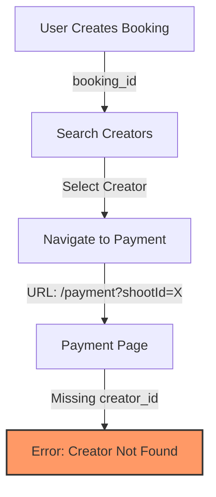

# Payment Flow Investigation

**Date**: 2025-12-28
**Issue**: "Creator Not Found" error on payment page
**URL**: `http://localhost:3000/search-results/payment?shootId=140`

## Problem Summary

The payment page is displaying a "Creator Not Found" error because the URL structure is missing the required `creatorId` parameter.

### Expected URL Structure
```
/search-results/[creatorId]/payment?shootId=140
```

### Actual URL Structure
```
/search-results/payment?shootId=140
```

**Root Cause**: The `creatorId` is missing from the URL path, causing the frontend to be unable to fetch creator details.

---

## Current Payment Flow Architecture

### 1. Backend API Endpoints

#### Payment Endpoints (`/api/payments`)
- **POST `/create-intent`** - Creates Stripe payment intent
  - Requires: `creator_id`, `hours`, `hourly_rate`, `shoot_date`, `location`
  - Returns: `clientSecret`, `paymentIntentId`, pricing breakdown

- **POST `/confirm`** - Confirms payment and creates payment record
  - Requires: `paymentIntentId`, `creator_id`, booking details
  - Updates: `stream_project_booking.payment_id`, `payment_completed_at`

- **GET `/:id/status`** - Gets payment status
  - Accepts: `payment_id` or `stripe_payment_intent_id`
  - Includes: creator details, user details, equipment, pricing

#### Booking Endpoints
- **POST `/api/bookings/create`** - Creates authenticated booking
- **GET `/api/bookings/:id`** - Gets single booking (requires auth)
- **POST `/api/guest-bookings/create`** - Creates guest booking
- **GET `/api/guest-bookings/:id`** - Gets guest booking by ID

#### Quote/Pricing Endpoints
- **GET `/api/pricing/quotes/:quoteId`** - Gets quote by ID
- **POST `/api/pricing/calculate`** - Calculates pricing quote

---

## Identified Issues

### Issue #1: Missing Creator ID in URL
**Severity**: 🔴 Critical

The frontend payment page expects a creator ID in the URL path, but the current URL only contains `shootId` as a query parameter.

**Impact**: Frontend cannot fetch creator details, resulting in "Creator Not Found" error.

### Issue #2: No Booking-to-Creator Relationship
**Severity**: 🔴 Critical

The `stream_project_booking` table does NOT have a direct relationship to `crew_members` (creators).

**Current Schema**:
```sql
stream_project_booking:
  - stream_project_booking_id
  - user_id (FK to users)
  - quote_id (FK to quotes)
  - guest_email
  - payment_id (FK to payment_transactions)
  ❌ No creator_id field
```

**Impact**: There's no way to retrieve which creator a booking is associated with directly from the booking record.

### Issue #3: Missing API Endpoint
**Severity**: 🟡 Important

No endpoint exists to retrieve booking details with creator information for the payment page.

**Needed**: `GET /api/bookings/:id/payment-details`

This should return:
- Booking information (date, location, hours, etc.)
- Associated creator details (from quote or payment intent metadata)
- Pricing/quote information
- Payment status

### Issue #4: Workflow Disconnect
**Severity**: 🟡 Important

The booking and payment flows are disconnected:

1. **Booking Creation** → Creates booking record without creator
2. **Creator Search** → User finds creators
3. **Payment Page** → Expects creator_id but has no way to link it to booking

**Missing Link**: When a user selects a creator from search results, there's no mechanism to associate that creator with the existing booking.

---

## Current Data Flow



### What's Missing

```
Booking (shootId: 140)
    ❌ No creator_id field
    ✅ Has quote_id (nullable)
    ✅ Has payment_id (nullable)

Payment Intent Metadata
    ✅ Has creator_id
    ✅ Has booking metadata
    ❌ Not linked to booking table

Quote
    ✅ Has booking_id
    ❌ No creator_id field
```

---

## Proposed Solutions

### Solution 1: Add Creator ID to Booking (Recommended)

**Database Migration**: Add `creator_id` to `stream_project_booking` table

```sql
ALTER TABLE stream_project_booking
ADD COLUMN creator_id INT NULL,
ADD CONSTRAINT fk_booking_creator
  FOREIGN KEY (creator_id)
  REFERENCES crew_members(crew_member_id);
```

**API Update**: Update guest-bookings and bookings controllers

```javascript
// When user selects a creator from search results
PUT /api/guest-bookings/:id/assign-creator
{
  "creator_id": 123
}
```

**Frontend Flow**:
1. User creates booking → gets `booking_id`
2. User searches creators → sees results
3. User clicks on creator → navigates to `/search-results/:creatorId/payment?shootId=:bookingId`
4. Before showing payment page, call API to associate creator with booking
5. Payment page fetches both booking and creator details

---

### Solution 2: Create Payment Details Endpoint

**New Endpoint**: `GET /api/bookings/:id/payment-details`

```javascript
exports.getBookingPaymentDetails = async (req, res) => {
  const { id } = req.params;
  const { creator_id } = req.query; // Get from URL params

  // Fetch booking
  const booking = await stream_project_booking.findByPk(id);
  if (!booking) {
    return res.status(404).json({ success: false, message: 'Booking not found' });
  }

  // Fetch creator
  let creator = null;
  if (creator_id) {
    creator = await crew_members.findByPk(creator_id, {
      include: [/* roles, equipment, reviews */]
    });
  } else if (booking.payment_id) {
    // Try to get creator from existing payment
    const payment = await payment_transactions.findByPk(booking.payment_id);
    if (payment) {
      creator = await crew_members.findByPk(payment.creator_id);
    }
  }

  // Fetch quote if exists
  let quote = null;
  if (booking.quote_id) {
    quote = await quotes.findByPk(booking.quote_id, {
      include: [{ model: quote_line_items }]
    });
  }

  return res.json({
    success: true,
    data: {
      booking: {
        booking_id: booking.stream_project_booking_id,
        event_date: booking.event_date,
        event_location: booking.event_location,
        duration_hours: booking.duration_hours,
        budget: booking.budget,
        // ...other fields
      },
      creator: creator ? {
        crew_member_id: creator.crew_member_id,
        name: `${creator.first_name} ${creator.last_name}`,
        role: creator.role_name,
        hourly_rate: creator.hourly_rate,
        rating: creator.rating,
        // ...other fields
      } : null,
      quote: quote,
      payment_status: booking.payment_id ? 'completed' : 'pending'
    }
  });
};
```

**Frontend Usage**:
```javascript
// Payment page component
const { creatorId } = useParams();
const searchParams = new URLSearchParams(location.search);
const shootId = searchParams.get('shootId');

const { data } = useQuery({
  queryKey: ['bookingPaymentDetails', shootId, creatorId],
  queryFn: () => fetch(`/api/bookings/${shootId}/payment-details?creator_id=${creatorId}`)
});
```

---

### Solution 3: Store Creator Selection in Session/State

**Temporary Solution** (not recommended for production):

Store selected creator in browser localStorage or session when user clicks on a creator from search results.

```javascript
// Search results page - when user clicks "Book" or "Pay"
function handleCreatorSelect(creator) {
  sessionStorage.setItem('selectedCreator', JSON.stringify(creator));
  router.push(`/search-results/${creator.id}/payment?shootId=${bookingId}`);
}

// Payment page - retrieve from session
function PaymentPage() {
  const storedCreator = JSON.parse(sessionStorage.getItem('selectedCreator'));
  // Use storedCreator data
}
```

**Drawbacks**:
- Data lost if user refreshes page
- Not shareable via URL
- Unreliable for guest users
- No server-side validation

---

## Recommended Implementation Plan

### Phase 1: Immediate Fix (Quick Win)
**Goal**: Get payment flow working ASAP

1. **Add creator_id to booking API**
   - Create `PATCH /api/guest-bookings/:id` endpoint
   - Allow updating creator_id after booking creation

2. **Update Frontend Flow**
   - When user clicks creator from search → update booking with creator_id
   - Navigate to payment page with both creatorId and shootId
   - Payment page validates both IDs exist and match

**Time**: 2-3 hours

---

### Phase 2: Add Payment Details Endpoint (Proper Fix)
**Goal**: Single API call for all payment page data

1. **Create endpoint**: `GET /api/bookings/:id/payment-details`
2. **Return comprehensive data**: booking + creator + quote + payment status
3. **Update frontend** to use new endpoint

**Time**: 4-5 hours

---

### Phase 3: Database Schema Enhancement (Long-term)
**Goal**: Proper data model for booking-creator relationship

1. **Add creator_id column** to stream_project_booking
2. **Create migration** with proper constraints
3. **Update all booking controllers** to handle creator assignment
4. **Add validation** to ensure creator_id is set before payment

**Time**: 1-2 days (includes testing, migration, deployment)

---

## Testing Checklist

After implementing fixes:

### Frontend Flow
- [ ] User can create booking → get booking ID
- [ ] User can search creators → see results
- [ ] User can click creator → navigate to payment page
- [ ] Payment page URL includes both creatorId and shootId
- [ ] Payment page displays correct creator details
- [ ] Payment page displays correct booking details

### API Validation
- [ ] `GET /api/bookings/:id/payment-details` returns full data
- [ ] `PATCH /api/guest-bookings/:id` allows creator assignment
- [ ] `POST /api/payments/create-intent` validates creator_id exists
- [ ] `POST /api/payments/confirm` updates booking with payment_id

### Edge Cases
- [ ] Handle invalid booking ID
- [ ] Handle invalid creator ID
- [ ] Handle mismatch between booking and creator
- [ ] Handle already-paid bookings
- [ ] Handle expired quotes

---

## Related Files

### Backend
- `src/routes/payments.routes.js` - Payment routes
- `src/controllers/payments.controller.js` - Payment logic (lines 37-172)
- `src/controllers/guest-bookings.controller.js` - Booking creation
- `src/models/stream_project_booking.js` - Booking schema
- `src/models/quotes.js` - Quote schema
- `src/models/payment_transactions.js` - Payment records

### Frontend (Inferred)
- `app/search-results/page.tsx` - Creator search page
- `app/search-results/[creatorId]/payment/page.tsx` - Payment page (likely)
- Booking modal component

---

## Questions to Answer

1. **Creator Selection**: How does a user indicate they want to book a specific creator from search results?
2. **Quote Integration**: Should quotes be created before payment, or is direct payment the primary flow?
3. **Guest vs Authenticated**: Are the flows different for guest users vs authenticated users?
4. **Payment Intent Timing**: When should the Stripe PaymentIntent be created - before or after creator selection?

---

## Next Steps

**Immediate Action Required**:
1. Clarify the intended user flow from booking → creator search → payment
2. Determine if bookings should always have a creator_id before payment
3. Implement Solution 1 or Solution 2 based on requirements
4. Test complete flow end-to-end

**Owner**: Backend Team
**Blocked By**: Frontend team input on desired UX flow
**Dependencies**: None (all tables exist, just need endpoints)

